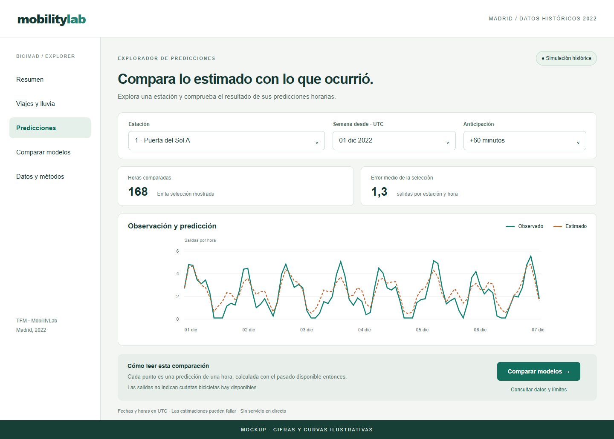

# 05. Diseño del frontal y experiencia de usuario

## 1. Solución y usuario

MobilityLab es un explorador de movilidad histórica para estudiantes y personas que analizan el uso de BiciMAD. Su tarea principal es comparar actividad y comprobar cuánto se aproxima una predicción a lo ocurrido. El frontal combina un dashboard de viajes y meteorología con un simulador histórico por estación.

## 2. Mockup principal

El mockup propone la pantalla de predicciones. Sus cifras y curvas son **ilustrativas**; no son resultados de una ejecución. La semana mostrada reúne predicciones horarias independientes, no una única predicción a siete días.

## 3. Justificación del diseño

### 3.1. Utilidad y valor

Estación, fecha y horizonte permiten pasar de una consulta general a un caso concreto. El gráfico compara salidas observadas y estimadas; el error medio y el número de horas ayudan a valorar la comparación. La acción principal es abrir la comparación de modelos o cambiar el periodo para revisar si el resultado se mantiene.

La pantalla principal prioriza datos, unidades y límites. Los detalles de entrenamiento y procedencia quedan en vistas secundarias, evitando que el usuario necesite conocimientos técnicos para interpretar la consulta.

### 3.2. Flujo de usuario

1. Entrar y reconocer que se trabaja con datos históricos de 2022.
2. Elegir estación, inicio del periodo y horizonte de 60 o 120 minutos.
3. Consultar predicciones ya calculadas con información disponible en cada instante histórico.
4. Comparar curvas, error y cobertura de la selección.
5. Abrir la comparación de modelos, revisar las limitaciones o cambiar los filtros.

Durante la carga se mostrará un mensaje de espera. Sin observaciones se indicará «No hay datos para esta selección», sin dibujar ceros. Si falla la lectura, se explicará el problema y se ofrecerá reintentar. Con pocos casos se advertirá de la cobertura limitada; no se inventará un nivel de confianza.

### 3.3. Experiencia de usuario

El título y el aviso de simulación fijan el contexto antes de mostrar cifras. Los filtros tendrán etiquetas visibles y conservarán las selecciones. Las curvas se distinguirán mediante color, leyenda y trazo, con unidades de salidas por hora y zona horaria explícita.

Se prevén contraste suficiente, navegación por teclado, foco visible y una disposición adaptable a móvil. Los estados de carga, vacío y error deben poder entenderse sin leer mensajes técnicos. La persona mantiene el control de la consulta; la aplicación no ejecuta acciones sobre la red.

## 4. Resultados y explicabilidad

El resultado principal es una estimación de salidas por estación-hora. Puede incluir decimales porque expresa un valor esperado. Se acompaña de observación real, error de la selección y acceso a referencias sencillas. El error de una semana no se confundirá con el error de toda la evaluación.

Se mantendrá visible que las cifras son históricas, que las predicciones pueden fallar y que las salidas no equivalen a bicicletas disponibles. Las vistas de detalle mostrarán modelo, periodo de evaluación, fuentes y limitaciones. **No se utilizará IA generativa**: las explicaciones se basarán en textos revisados y resultados calculados.

## 5. Alcance del MVP

La implementación actual ya incluye gráficos de viajes, comparación meteorológica, filtros del simulador, comparación de modelos y consulta de calidad. Utiliza React y TypeScript, con resultados preparados en Python y publicados como JSON local.

El mockup es una propuesta visual de esa experiencia; su distribución, mensajes de reintento y advertencias contextuales deberán revisarse antes de darlos por implementados. La adaptación móvil y la accesibilidad son criterios de aceptación pendientes de comprobar en la versión final. Quedan fuera la disponibilidad en directo, las alertas de estación vacía o llena y la redistribución automática.
